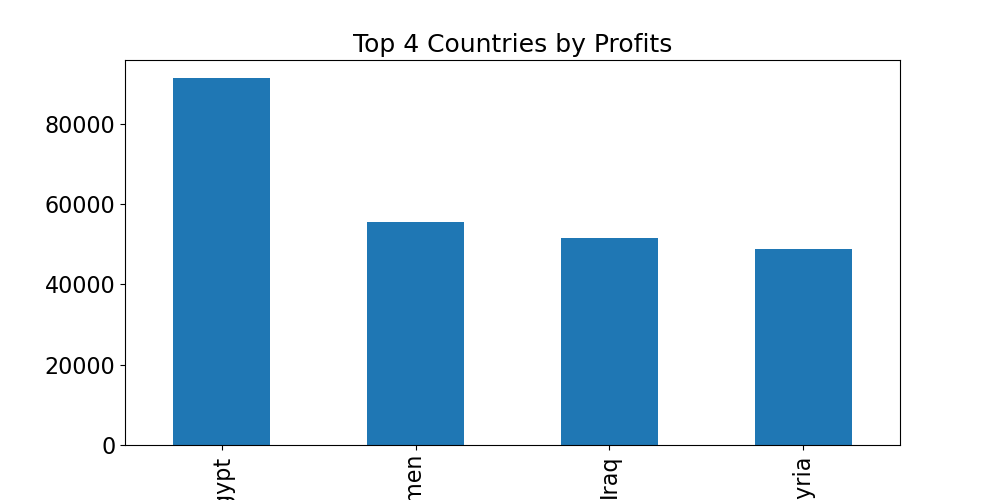

# 📊 AI-Powered Sales Forecasting & Analysis System


A professional, structured Python system designed for analyzing international computer sales data, processing complex temporal patterns, and generating business intelligence insights through interactive visualizations.

## 🚀 Key Features

* **Automated Data Loading**: Seamlessly handles Excel (.xlsx) and CSV files via a user-friendly Tkinter GUI file picker.
* **Deep Temporal Analysis**: Custom-built logic to transform raw date strings into meaningful Year, Month, and Day features for trend analysis.
* **Business Intelligence Dashboard**: 
    * **Financial Metrics**: Real-time calculation of Total Profits, Sales Count, and Market Average Price.
    * **Geo-Performance**: Automated ranking of Top 4 performing countries.
* **Advanced Visual Analytics**:
    * **Brand Insights**: Bar charts for top-performing computer types (HP, Dell, Apple, etc.).
    * **Demographic Breakdown**: Pie charts illustrating profit distribution by Gender.
    * **Time-Series Insights**: Dynamic analysis of profits by Year and Day of the week.

## 📁 Project Structure

* `main.py`: The core application entry point and orchestration layer.
* `analytics.py`: Internal engine for data aggregation and temporal processing.
* `data_loader.py`: Robust module for file handling and data integrity checks.
* `Chart_image/`: Automated directory for storing high-resolution analysis figures.

## 🛠️ Setup & Installation

1.  **Clone the repository**:
    ```bash
    git clone [https://github.com/Adham-DataScientist/AI-Sales-Forecasting-System.git](https://github.com/Adham-DataScientist/AI-Sales-Forecasting-System.git)
    cd AI-Sales-Forecasting-System
    ```

2.  **Install dependencies**:
    ```bash
    pip install pandas matplotlib openpyxl scikit-learn
    ```

3.  **Run the application**:
    ```bash
    python main.py
    ```

## 📈 Sample Analytics
*Below is a sample of the automated visualization generated by the system:*



## 🤖 Future Work: AI Integration
The next evolution of this project focuses on transitioning from **Descriptive** to **Predictive** analytics:

* **Profit Prediction**: Utilizing `LinearRegression` to estimate future profit margins based on pricing and product categories.
* **Seasonal Sales Forecasting**: Implementing time-series models to predict high-demand periods.
* **Market Optimization**: AI-driven recommendations on brand inventory management per region.

---
**Developed by Adham Mahmoud | Data Science Journey**